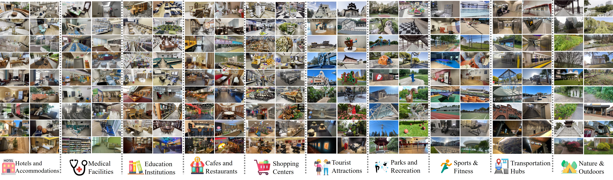
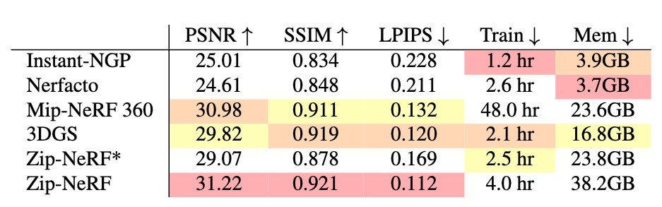
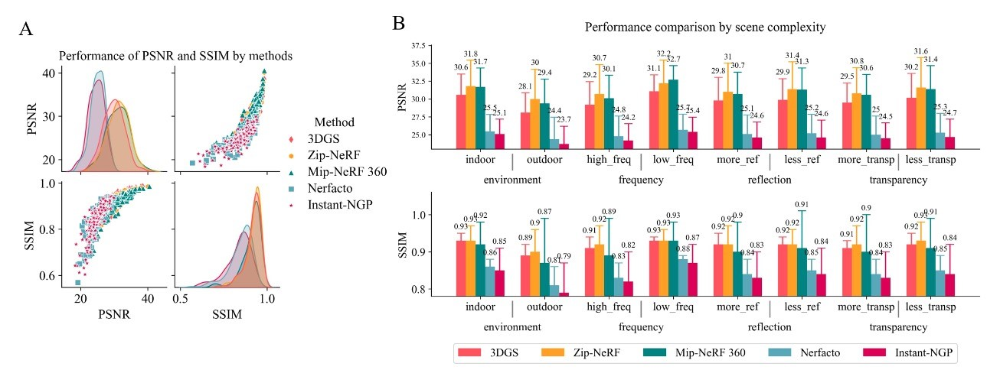
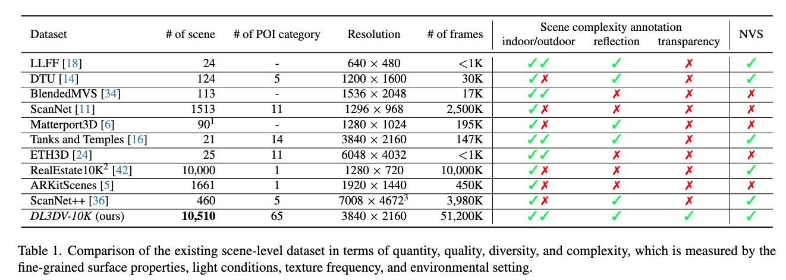
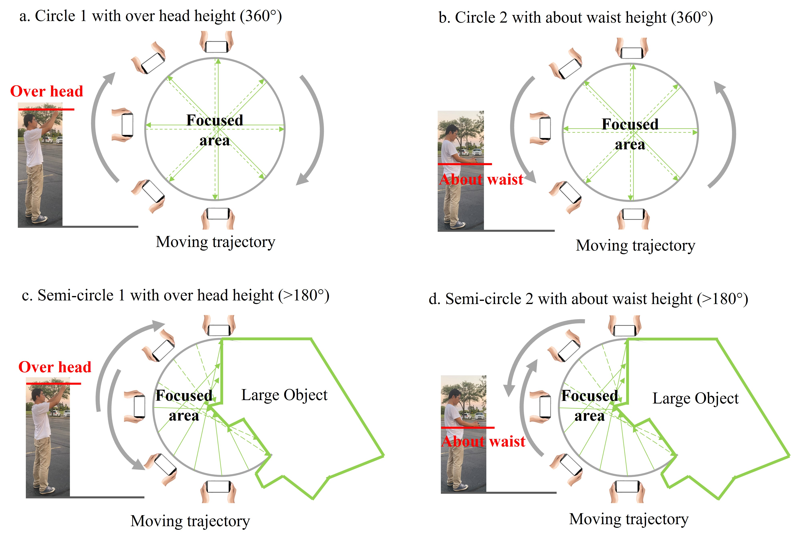

<div align="center">
	
# DL3DV-10K Dataset 
	
**DL3DV-10K is a dataset of real-world scene-level videos with scene annotations.**

This repo helps you get ready to download all the DL3DV-10K dataset.



---
<p align="center">
  <a href="#dataset-download">Dataset Download</a> •
  <a href="https://dl3dv-10k.github.io/DL3DV-10K/">Website</a> •
  <a href="#nvs-benchmark-training-results">NVS Benchmark Training Results</a> •
  <a href="#data-preparation">Data Preparation</a> •
  <a href="#license">License</a> •
  <a href="#issues">Issues</a> •
  <a href="#bibtex">BibTex</a> 
	
</p>

</div>

## News 🔥🔥🔥
* [DepthSplat](https://github.com/cvg/depthsplat) further builds on top of DL3DV. Take a look at their work and processed [dataset](https://github.com/cvg/depthsplat/blob/main/DATASETS.md)!
* To help you create teaser image/videp. We released all the drone videos to DL3DV huggingface: [drone](https://huggingface.co/datasets/DL3DV/DL3DV-Drone).
* **We released all 10K videos/images/poses to huggingface!** Remember to update the [download.py](https://github.com/DL3DV-10K/Dataset/blob/main/scripts/download.py) script.


## Abstract
We have witnessed significant progress in deep learning-based 3D vision, ranging from neural radiance field (NeRF) based 3D representation learning to applications in novel view synthesis (NVS). However, existing scene-level datasets for deep learning-based 3D vision, limited to either synthetic environments or a narrow selection of real-world scenes, are quite insufficient. This insufficiency not only hinders a comprehensive benchmark of existing methods but also caps what could be explored in deep learning-based 3D analysis. To address this critical gap, we present DL3DV-10K, a large-scale scene dataset, featuring 51.2 million frames from 10,510 videos captured from 65 types of point-of-interest (POI) locations, covering both bounded and unbounded scenes, with different levels of reflection, transparency, and lighting. We conducted a comprehensive benchmark of recent NVS methods on DL3DV-10K, which revealed valuable insights for future research in NVS. In addition, we have obtained encouraging results in a pilot study to learn generalizable NeRF from DL3DV-10K, which manifests the necessity of a large-scale scene-level dataset to forge a path toward a foundation model for learning 3D representation.

## Key Feature
- 10,510 multi-view scenes covering 51.2 million frames at 4k resolution.
- 140 videos as Novel view synthesis (NVS) benchmark.
- All videos are annotated by scene environment (indoor vs. outdoor), levels of reflection, transparency, and lighting.
- Released samples include colmap calculated camera pose.
- Benchmark videos offer trained parameters from the SOTA NVS methods, including 3D Gaussian Splatting, ZipNeRF, Mip-NeRF 360, Instant-NGP, and Nerfacto.


## NVS Benchmark Training Results
We report the performances of the main STOA methods (2023 Fall) on our large-scale NVS benchmark. Here are the quantitative results. Please refer to our paper for more details (e.g. more quantitative and qualitative results.)

<div align="center">

</div>

Performance on the benchmark. The error metric is calculated from the mean of 140 scenes on a scale factor of 4. Zip-NeRF uses the default batch size (65536) and Zip-NeRF* uses the identical batch size as other methods (4096). Note, the training time and memory usage may be different depending on various configurations. 

<div align="center">

</div>

A presents the density plot of PSNR and SSIM and their relationship on \benchmark~for each method. B describes the performance comparison by scene complexity. The text above the bar plot is the mean value of the methods on the attribute.

## Data Preparation
### Data Scale


DL3DV-10K has more than **10K** high-quality videos that cover diverse real-world scenes for 3D vision tasks.

### Data collection
      
We have formulated the following requirements as guidelines for recording high-quality scene-level videos:

<div align="center">

</div>

 - The scene coverage is in the circle or half-circle with a 30 secs-45 secs walking diameter and has at least five instances with a natural arrangement. 
 - The default focal length of the camera corresponds to the 0.5x ultra-wide mode for capturing a wide range of background information.  
 - Each video has a horizontal view of at least 180◦ or 360◦ from different heights, including overhead and waist. It offers high-density views of objects within the coverage area.
 - The video resolution should be 4K and have 60 fps (or 30 fps).
 - The video's length should be at least 60 secs for mobile phone capture and 45 secs for drone video recording.
 - We recommend limiting the duration of moving objects in the video to under 3 secs, with a maximum allowance of 10 secs.
 - The frames should not be motion-blurred or overexposed, and the captured objects should be stereoscopic. 


### Data statistics
<a href="https://dl3dv-10k.github.io/DL3DV-10K/">Visit DL3DV-10K Website</a>


## Dataset Download
### Dataset Preview 
We provide a preview page [here](https://htmlpreview.github.io/?https://github.com/DL3DV-10K/Dataset/blob/main/visualize/index.html). The preview page has a snapshot of each scene, its hash code and labels. Some of the missing labels should be updated soon.

### Download Instructions
- [x] Free download sample videos (11 scenes)
	- [x] Access [here](https://huggingface.co/datasets/DL3DV/DL3DV-10K-Sample/tree/main)

- [ ] Benchmark dataset release (140 scenes)
	- [x] Raw videos
	- [x] Benchmark images, camera pose (**Ready for download**)
         * The user requests **[here](https://huggingface.co/datasets/DL3DV/DL3DV-10K-Benchmark)**.
         * We provide both Nerfstudio and 3D Gaussian Splatting formats for benchmark scenes.
           <!--* Step 2: The user is expected to sign the **[DL3DV-10K Terms of Use](https://github.com/DL3DV-10K/Dataset/blob/main/DL3DV-10K_term_of_use.pdf)**, send it to `ling58@purdue.edu` and **request the dataset from [here](https://huggingface.co/datasets/DL3DV/DL3DV-ALL)**. If your singed term of use is valid, you will be approved and allowed to download.-->
   	- [ ] Benchmark trained weights for 3D Gaussian Splatting, ZipNeRF, Mip-NeRF 360, Instant NGP, and Nerfacto ( **Coming soon**)

- [X] 10K Full Dataset Release:
  The whole dataset is extremly large. Here are different versions for different needs.
  - 480P resolution frames with poses (~730G). [Dataset link](https://huggingface.co/datasets/DL3DV/DL3DV-ALL-480P).
  - 960P resolution frames with poses (~2.8T).[Dataset link](https://huggingface.co/datasets/DL3DV/DL3DV-ALL-960P).
  - 2K resolution frames with poses (~11T). [Dataset link](https://huggingface.co/datasets/DL3DV/DL3DV-ALL-2K).
  - 4K resolution frames with poses (~44T). [Dataset link](https://huggingface.co/datasets/DL3DV/DL3DV-ALL-4K).
  - 4K videos (~7T). [Dataset link](https://huggingface.co/datasets/DL3DV/DL3DV-ALL-video).
  - COLMAP cache folders (may be useful if you need post-processing based on those cach). [Dataset link](https://huggingface.co/datasets/DL3DV/DL3DV-ALL-ColmapCache).

<!-- ~~Sign the above DL3DV-10K Terms of Use, send it to ling58@purdue.edu and request the 4K-resolution version from here or 1080P version from here. If your singed term of use is valid, you will be approved and allowed to download.~~ -->

  Please go to the relevant huggingface dataset page and request the access. If you request the access, you automatically sign our term of use and license and can access the dataset. **Note, the latest license is open to the usage of the dataset. But it is the user's responsibility to keep the use appropriately. The DL3DV organization disclaims any responsibility for the misuse, inappropriate use, or unethical application of the dataset by individuals or entities who download or access it. More details can be found in our license.**

  If you have enough space, you can use git to download a dataset from huggingface. See this [link](https://huggingface.co/docs/hub/en/datasets-downloading). 480P/960P versions should satisfies most needs. 

  If you do not have enough space, we further provide a [download script](https://github.com/DL3DV-10K/Dataset/blob/main/scripts/download.py) here to download a subset. First make sure you have applied for the access (See above). To set up the environment for the script, call this in your python virtual environment:

  ```Bash
  pip install huggingface_hub tqdm pandas
  ```

  The usage for the download.py: 

  ```Bash
  usage: download.py [-h] --odir ODIR --subset {1K,2K,3K,4K,5K,6K,7K,8K,9K,10K} --resolution {4K,2K,960P,480P} --file_type {images+poses,video,colmap_cache} [--hash HASH]
                    [--clean_cache]

  optional arguments:
    -h, --help            show this help message and exit
    --odir ODIR           output directory
    --subset {1K,2K,3K,4K,5K,6K,7K,8K,9K,10K}
                          The subset of the benchmark to download
    --resolution {4K,2K,960P,480P}
                          The resolution to donwnload
    --file_type {images+poses,video,colmap_cache}
                          The file type to download
    --hash HASH           If set subset=hash, this is the hash code of the scene to download
    --clean_cache         If set, will clean the huggingface cache to save space
  ```

  Here are some examples:
  ```Bash
  # Make sure you have applied for the access.
  # Use this to download the download.py script 
  wget https://raw.githubusercontent.com/DL3DV-10K/Dataset/main/scripts/download.py 

  # Download 480P resolution images and poses, 0~1K subset, output to DL3DV-10K directory   
  python download.py --odir DL3DV-10K --subset 1K --resolution 480P --file_type images+poses --clean_cache


  # Download 960P resolution images and poses, 0~1K subset, output to DL3DV-10K directory   
  python download.py --odir DL3DV-10K --subset 1K --resolution 960P --file_type images+poses --clean_cache


  # Download 2K resolution images and poses, 0~1K subset, output to DL3DV-10K directory   
  python download.py --odir DL3DV-10K --subset 1K --resolution 2K --file_type images+poses --clean_cache


  # Download 4K resolution images and poses, 0~1K subset, output to DL3DV-10K directory   
  python download.py --odir DL3DV-10K --subset 1K --resolution 4K --file_type images+poses --clean_cache


  # Download 4K resolution videos, 0~1K subset, output to DL3DV-10K directory   
  python download.py --odir DL3DV-10K --subset 1K --resolution 4K --file_type video --clean_cache


  # Download 480P resolution images and poses, 1K~2K subset, output to DL3DV-10K directory   
  python download.py --odir DL3DV-10K --subset 2K --resolution 480P --file_type images+poses --clean_cache
  ```


## License

DL3DV-10K is released under the DL3DV-10K Terms of Use. <!--~~and the code is released under the Attribution-NonCommercial 4.0 International License.~~--> The **[DL3DV-10K Terms of Use](https://github.com/DL3DV-10K/Dataset/blob/main/DL3DV-10K_term_of_use.pdf)**, disclaimer, and the [copy](https://github.com/DL3DV-10K/Dataset/blob/main/License.md) of the license are available in this repository.

Copyright (c) 2024

## Issues
Despite our best efforts to anonymize data, there may be instances where sensitive details are inadvertently included. If you identify any such issues within the dataset (scenes), don't hesitate to get in touch with us at [issue](mailto:ling58@purdue.edu). We will manually redact any sensitive information to ensure the privacy and integrity of the dataset. 

**Want to contribute the DL3DV-10K dataset?** Upload your video [here](https://app.box.com/s/df2splzjgd6bkwea02x8lx13wbstd62t).

## About
The DL3DV-10K team is a non-profit organization with members inlcuding the authors of **[DL3DV-10K paper](https://arxiv.org/abs/2312.16256)**  and volunteers who contribute to the dataset. Our mission is to make large-scale of deep learning models and datasets available to the general public.


## BibTeX
If you found this dataset useful, please cite our [paper](https://arxiv.org/abs/2312.16256).

```
@inproceedings{ling2024dl3dv,
  title={Dl3dv-10k: A large-scale scene dataset for deep learning-based 3d vision},
  author={Ling, Lu and Sheng, Yichen and Tu, Zhi and Zhao, Wentian and Xin, Cheng and Wan, Kun and Yu, Lantao and Guo, Qianyu and Yu, Zixun and Lu, Yawen and others},
  booktitle={Proceedings of the IEEE/CVF Conference on Computer Vision and Pattern Recognition},
  pages={22160--22169},
  year={2024}
}

```
## Related Works 
* DL3DV data is mostly processed by [*NeRFstudio*](https://github.com/nerfstudio-project/nerfstudio/). All the data convention follows the NeRFStudio convention.
* [DepthSplat](https://github.com/cvg/depthsplat/tree/main) is a very cool work that builds on DL3DV. Remeber to take a look!
