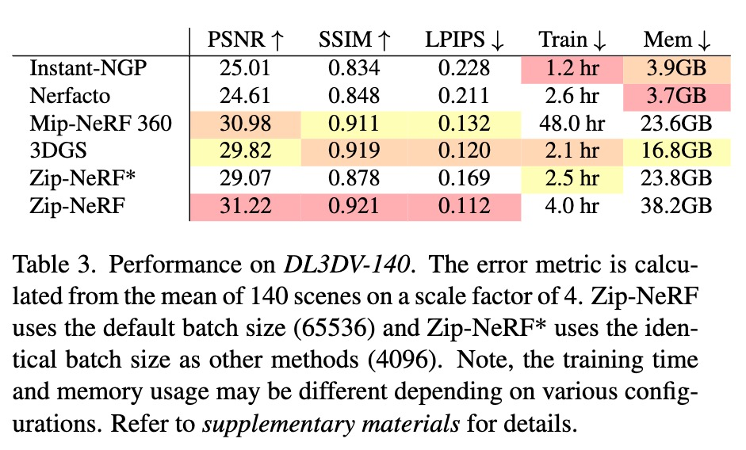
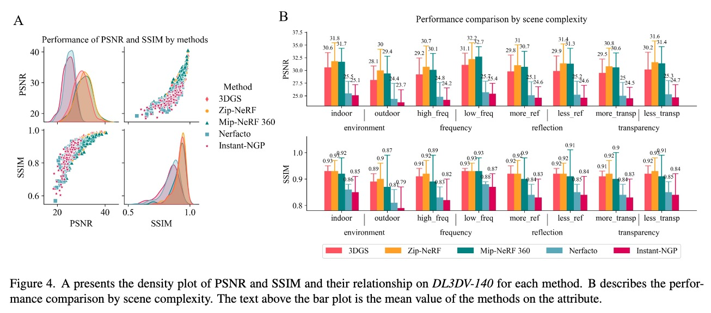

# DL3DV-10K Dataset 
	
** DL3DV-10K is a dataset of real-world scene-level videos with scene annotations.**

This repo helps you get ready to download all the DL3DV-10K dataset.

---

  <a href="[https://dl3dv-10k.github.io/DL3DV-10K/]">Website</a> •
  <a href="#dataset-format">Dataset Format</a> •
  <a href="#tutorials">Tutorials</a> •
  <a href="#license">License</a>

We introduce DL3DV-10K, a large-scale, scene dataset capturing real-world scenarios. DL3DV-10K contains 51.2 million frames from 10,510 videos at 4K resolution spanning 65 types of point-of-interest (POI) locations, covering a wide range of everyday areas. In addition to scene diversity annotation, DL3DV-10K enjoys a fine-grained annotation that covers environment settings (indoor and outdoor scenes),  different levels of reflection, transparency, and lighting. DL3DV-10K enables a comprehensive benchmark for novel view synthesis and supports learning-based 3D representation techniques in acquiring a universal prior at scale.

## Key Feature
- 10,510 multi-view scenes covering 51.2 million frames at 4k resolution.
- 140 videos as Novel view synthesis (NVS) benchmark.
- All videos are annotated by scene environment (indoor vs. outdoor), levels of reflection, transparency, and lighting.
- Released samples include camera pose and point cloud.
- Benchmark videos offer trained parameters from the SOTA NVS methods, including 3D Gaussian Splatting, ZipNeRF, Mip-NeRF 360, Instant-NGP, and Nerfacto.

## DL3DV Novel View Synthesis Benchmark 
We report the performances of the main STOA methods (2023 Fall) on our large-scale NVS benchmark. Here is the quantitative results. Please refer to our paper for more details (e.g. more quantitative and qualitative results.)

Performance on the benchmark. The error metric is calculated from the mean of 140 scenes on a scale factor of 4. Zip-NeRF uses the default batch size (65536) and Zip-NeRF* uses the identical batch size as other methods (4096). Note, the training time and memory usage may be different depending on various configurations. 

A presents the density plot of PSNR and SSIM and their relationship on \benchmark~for each method. B describes the performance comparison by scene complexity. The text above the bar plot is the mean value of the methods on the attribute.

## Data Preparation
- [ ] Data Scale

DL3DV-10K has more than **10K** high quality videos that cover diverse real-world scenes for 3D vision tasks.

- [ ] Data collection
      
We have formulated the following requirements as guidelines for recording high-quality scene-level videos:

 - [-] The scene coverage is in the circle or half-circle with a 30 secs-45 secs walking diameter and has at least five instances with a natural arrangement. 
 - [-] The default focal length of the camera corresponds to the 0.5x ultra-wide mode for capturing a wide range of background information.  
 - [-] Each video has a horizontal view of at least 180◦ or 360◦ from different heights, including overhead and waist. It offers high-density views of objects within the coverage area.
 - [-] The video resolution should be 4K and have 60 fps (or 30 fps).
 - [-] The video's length should be at least 60 secs for mobile phone capture and 45 secs for drone video recording.
 - [-] We recommend limiting the duration of moving objects in the video to under 3 secs, with a maximum allowance of 10 secs.
 - [-] The frames should not be motion-blurred or overexposed, and the captured objects should be stereoscopic. 

- [ ] Data statistics
      
      [Visit DL3DV-10K Website](https://dl3dv-10k.github.io/DL3DV-10K/)

## Updates (2023-10-22)
- [ ] Benchmark Dataset Release
	- [-] Benchmark statistics 
	- [-] Benchmark training results  
	- [-] Raw videos 
	- [ ] Sample videos 

- [ ] 10K Full Dataset Release

## DL3DV Novel View Synthesis Benchmark 
We report the performances of the main STOA methods (2023 Fall) on our large-scale NVS benchmark. Here is the quantitative results. Please refer to our paper for more details (e.g. more quantitative and qualitative results.)

### Benchmark Sample 
https://huggingface.co/datasets/ysheng/DL3DV-10K/tree/main

### Benchmark Download 
A benchmark sample (~15 videos that cover challenging real-world scenes) can be found in TODO.  
Please send an email to `ling58@purdue.edu` to get instructions to download the full benchmark.   

## DL3DV-10K Dataset 

DL3DV-10K has more than **10K** high quality videos that cover diverse real-world scenes for 3D vision tasks 

**The downloading site is still under developping. Stay tuned!**

## Citation
TODO

<!-- ## Dataset Distributions

## Download 
### DL3DV-10K Dataset
**Stay tuned!**

### NVS Benchmark
 -->
